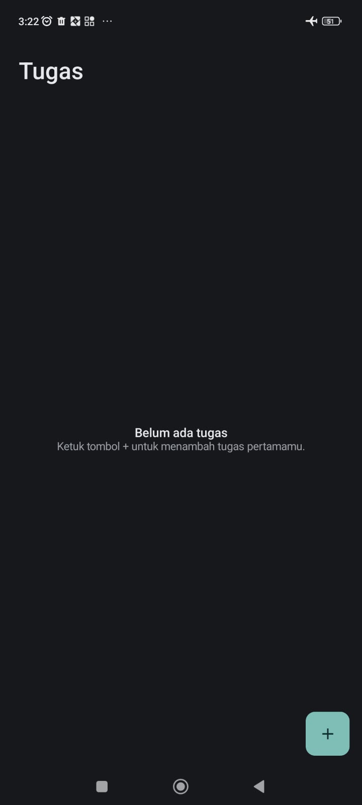
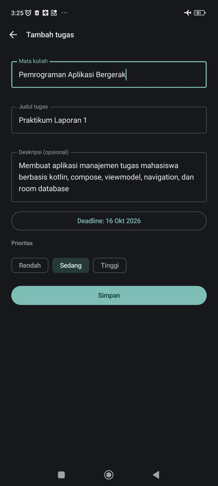
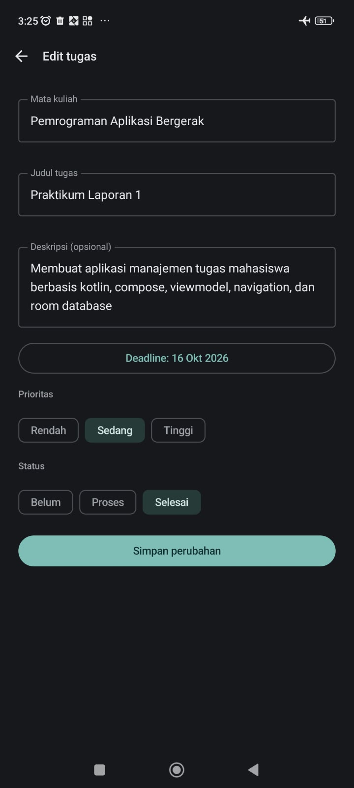
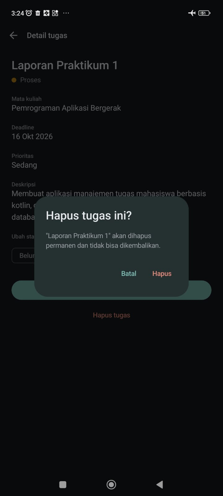
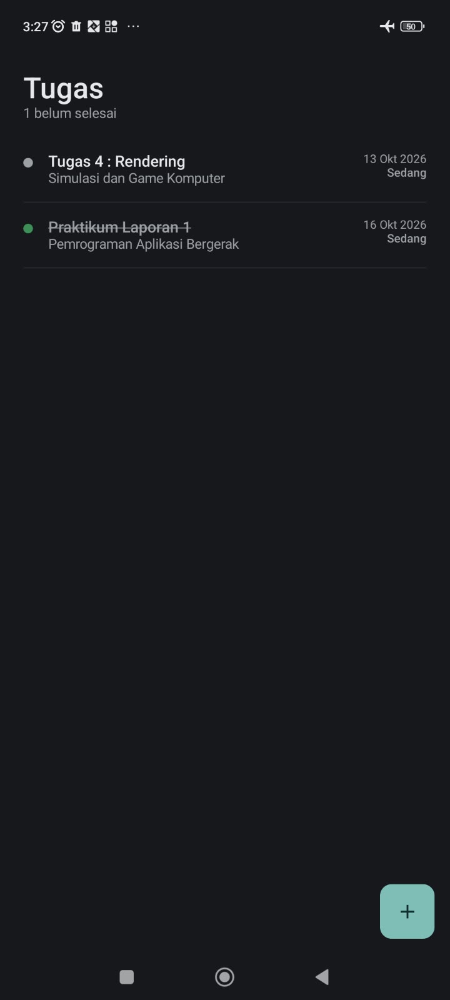

# TugasKu

Aplikasi Android untuk mencatat dan memantau tugas kuliah yang **berjalan sepenuhnya offline**.
Data tersimpan di perangkat sehingga tidak hilang ketika aplikasi ditutup.

Dibuat untuk Studi Kasus Praktikum 1 (Offline Mobile Application), mata kuliah
Pemrograman Aplikasi Bergerak, Program Studi Informatika, Universitas Mulia.

- **Nama:** Yuda Pratama
- **NIM:** 2411009

## Latar belakang

Mahasiswa menerima tugas dari banyak mata kuliah, dan informasinya sering tersebar di chat,
LMS, dan catatan pribadi. TugasKu mengumpulkannya di satu tempat dan tetap bisa dipakai
tanpa koneksi internet.

## Fitur

- Menampilkan daftar tugas dari database lokal, diurutkan berdasarkan deadline terdekat
- Menambah tugas baru melalui form dengan validasi (mata kuliah, judul, dan deadline wajib diisi)
- Melihat detail satu tugas secara lengkap
- Mengubah data tugas yang sudah tersimpan
- Menghapus tugas dengan dialog konfirmasi
- Mengubah status tugas: Belum, Proses, atau Selesai
- Menyimpan prioritas tugas: Rendah, Sedang, atau Tinggi
- Tampilan minimalis dengan dukungan mode terang dan gelap

## Tangkapan layar

<table>
  <tr>
    <td align="center"><br>Tampilan awal</td>
    <td align="center"><br>Tambah tugas</td>
    <td align="center"><br>Edit tugas</td>
  </tr>
  <tr>
    <td align="center"><br>Konfirmasi hapus</td>
    <td align="center"><br>Daftar setelah edit</td>
    <td></td>
  </tr>
</table>

## Teknologi

| Bagian | Teknologi |
|--------|-----------|
| Bahasa | Kotlin 2.0.0 |
| UI | Jetpack Compose, Material Design 3 (Compose BOM 2024.04.01) |
| State | ViewModel dan StateFlow (Lifecycle 2.8.7) |
| Navigasi | Navigation Compose 2.7.7 |
| Database lokal | Room 2.6.1 (KSP 2.0.0-1.0.21) |
| Build | Android Gradle Plugin 8.8.0, compileSdk 35, minSdk 27 |

## Arsitektur

```
Compose UI → ViewModel → Repository → Room DAO → Database
```

UI hanya menampilkan state dan mengirim event. Akses data berada di ViewModel, Repository,
dan DAO, sehingga UI tidak pernah mengakses database secara langsung.
Alasan teknis dan diagram lengkap ada di [docs/RANCANGAN.md](docs/RANCANGAN.md).

### Struktur project

```
app/src/main/java/com/example/tugasku/
├── data/
│   ├── local/         Tugas (Entity), TugasDao, AppDatabase
│   └── repository/    TugasRepository
├── ui/
│   ├── component/     AppTopBar, StatusDot, Pemisah
│   ├── navigation/    AppNavGraph
│   ├── screen/        DaftarScreen, TambahScreen, DetailScreen, EditScreen, TugasForm
│   ├── state/         DaftarUiState
│   ├── theme/         Color, Type, Theme
│   └── viewmodel/     TugasViewModel
├── util/              Format (tanggal dan label)
└── MainActivity.kt
```

### Model data

| Field | Tipe | Keterangan |
|-------|------|------------|
| `id` | Int | Primary key, dibuat otomatis |
| `mataKuliah` | String | Mata kuliah pemberi tugas |
| `judul` | String | Judul tugas |
| `deskripsi` | String | Penjelasan tugas (opsional) |
| `deadline` | Long | Milidetik sejak epoch |
| `prioritas` | Prioritas | RENDAH, SEDANG, TINGGI |
| `status` | StatusTugas | BELUM, PROSES, SELESAI |

## Cara menjalankan

1. Pasang Android Studio versi yang mendukung Android Gradle Plugin 8.8.0
   (Ladybug Feature Drop atau lebih baru).
2. Clone repository ini:
   ```bash
   git clone https://github.com/2411009-yuda/TugasKu.git
   ```
3. Buka folder hasil clone melalui **File → Open** di Android Studio.
4. Tunggu proses **Gradle sync** selesai. Pertama kali membutuhkan koneksi internet
   untuk mengunduh dependency.
5. Siapkan emulator (API 27 atau lebih baru) lewat **Device Manager**, atau sambungkan
   perangkat Android.
6. Klik **Run**.

Setelah dependency terunduh, aplikasi dapat dipakai tanpa internet.

## Cara menguji fitur offline

1. Tambahkan satu tugas.
2. Tutup aplikasi sepenuhnya melalui recent apps.
3. Buka lagi: tugas masih ada.
4. Ulangi dengan mode pesawat aktif: hasilnya sama.

## Dokumentasi tambahan

- [Rancangan aplikasi](docs/RANCANGAN.md): kebutuhan, alur layar, model data, dan keputusan teknis
- [Refleksi teknis](docs/REFLEKSI.md)