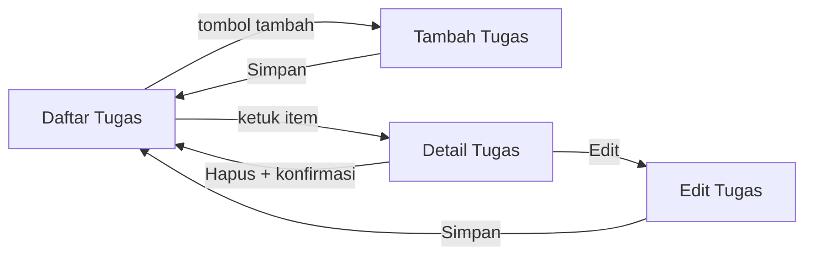
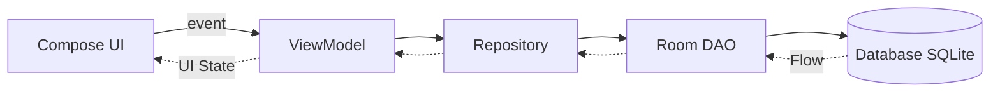

# Rancangan Aplikasi TugasKu

Aplikasi manajemen tugas mahasiswa yang dapat digunakan **tanpa koneksi internet**.
Dibangun dengan Kotlin, Jetpack Compose, ViewModel, Navigation, dan Room Database.

- **Nama:** Yuda Pratama
- **NIM:** 2411009
- **Mata kuliah:** Pemrograman Aplikasi Bergerak, Universitas Mulia
- **Package:** `com.example.tugasku`

---

## 1. Analisis Kebutuhan

### 1.1 Latar belakang masalah
Mahasiswa menerima tugas dari banyak mata kuliah. Informasinya tersebar di chat, LMS,
dan catatan pribadi, sehingga mudah terlewat. Aplikasi ini mengumpulkan semuanya di satu
tempat dan tetap dapat diakses saat tidak ada internet.

### 1.2 Tantangan utama
1. Data harus tetap tersedia tanpa internet.
2. Tampilan harus sederhana dan nyaman di layar kecil.
3. Perubahan tugas harus langsung terlihat pada daftar.

### 1.3 Kebutuhan fungsional

| No | Kebutuhan | Layar terkait |
|----|-----------|---------------|
| F1 | Menampilkan daftar tugas dari database lokal | Daftar |
| F2 | Menambahkan tugas baru melalui form input | Tambah |
| F3 | Melihat detail satu tugas secara lengkap | Detail |
| F4 | Mengubah data tugas yang sudah tersimpan | Edit |
| F5 | Menghapus tugas dengan konfirmasi pengguna | Detail |
| F6 | Mengubah status tugas: Belum, Proses, atau Selesai | Detail / Daftar |

### 1.4 Kebutuhan non-fungsional
- Aplikasi berjalan sepenuhnya tanpa koneksi internet.
- Data tidak hilang saat aplikasi ditutup atau perangkat di-restart.
- UI tidak mengakses database secara langsung.
- Screen, state, ViewModel, dan data layer dipisahkan.
- Minimum SDK: API 27 (Android 8.1 Oreo).

### 1.5 Fitur opsional (jika waktu cukup)
- Filter berdasarkan status.
- Pencarian berdasarkan judul atau mata kuliah.
- Penanda visual untuk tugas dengan tenggat dekat.

---

## 2. Alur Pengguna dan Struktur Layar

Aplikasi memiliki **empat layar utama**.

| Layar | Fungsi | Isi utama |
|-------|--------|-----------|
| Daftar Tugas | Layar awal | Daftar tugas (judul, mata kuliah, deadline, prioritas, status), tombol tambah |
| Tambah Tugas | Input tugas baru | Form 5 isian, tombol Simpan |
| Detail Tugas | Melihat satu tugas | Semua field, pengubah status, tombol Edit dan Hapus |
| Edit Tugas | Mengubah tugas | Form yang sudah terisi data lama, tombol Simpan |

### 2.1 Diagram alur



### 2.2 Rute navigasi

| Rute | Layar |
|------|-------|
| `daftar` | Daftar Tugas |
| `tambah` | Tambah Tugas |
| `detail/{id}` | Detail Tugas |
| `edit/{id}` | Edit Tugas |

Hanya `id` yang dikirim lewat rute. Data lengkap dibaca ulang dari database sehingga
selalu mutakhir.

### 2.3 Aturan validasi form

| Field | Aturan |
|-------|--------|
| Mata kuliah | Wajib diisi |
| Judul | Wajib diisi |
| Deskripsi | Boleh kosong |
| Deadline | Wajib dipilih |
| Prioritas | Pilih salah satu (default: Sedang) |

Tombol Simpan hanya aktif ketika field wajib sudah terisi. Pesan error ditampilkan di bawah
field yang bermasalah.

---

## 3. Model Data

Tabel `tugas` pada Room Database.

| Field | Tipe Kotlin | Keterangan |
|-------|-------------|------------|
| `id` | `Int` | Primary key, dibuat otomatis, pembeda setiap tugas |
| `mataKuliah` | `String` | Nama mata kuliah pemberi tugas |
| `judul` | `String` | Judul singkat tugas |
| `deskripsi` | `String` | Penjelasan tugas |
| `deadline` | `Long` | Milidetik sejak epoch, memudahkan pengurutan |
| `prioritas` | `Prioritas` | `RENDAH`, `SEDANG`, `TINGGI` |
| `status` | `StatusTugas` | `BELUM`, `PROSES`, `SELESAI` |

Kegunaan field:
- `deadline` dipakai untuk mengurutkan daftar dan menandai tugas yang mendesak.
- `prioritas` membantu menentukan pekerjaan yang harus didahulukan.
- `status` menjadi dasar filter dan penanda progres.

Daftar diurutkan berdasarkan `deadline` dari yang paling dekat.

---

## 4. Arsitektur



| Lapisan | Tanggung jawab |
|---------|----------------|
| Compose UI | Menampilkan state dan meneruskan aksi pengguna sebagai event |
| ViewModel | Menyimpan UI state, memproses event, memanggil Repository |
| Repository | Perantara tunggal ke sumber data, menyembunyikan detail Room |
| Room DAO | Mendefinisikan query dan operasi database |
| Database | Menyimpan data secara permanen di perangkat |

### 4.1 Struktur package

```
com.example.tugasku/
├── data/
│   ├── local/        Tugas.kt, TugasDao.kt, AppDatabase.kt
│   └── repository/   TugasRepository.kt
├── ui/
│   ├── screen/       DaftarScreen, TambahScreen, DetailScreen, EditScreen
│   ├── viewmodel/    TugasViewModel.kt
│   ├── navigation/   AppNavGraph.kt
│   └── theme/
└── MainActivity.kt
```

---

## 5. Keputusan Teknis dan Alasannya

**Mengapa data disimpan menggunakan Room?**
Aplikasi harus berfungsi offline dan datanya tidak boleh hilang saat ditutup. Room adalah
lapisan resmi Jetpack di atas SQLite yang tersimpan di perangkat. Query diperiksa saat
kompilasi, dan hasil query berupa `Flow` sehingga daftar di layar ter-update otomatis saat
data berubah. Variabel biasa akan hilang ketika aplikasi ditutup.

**Bagian mana yang menyimpan UI state?**
ViewModel. State dipegang di ViewModel sehingga bertahan saat layar diputar, sedangkan
composable hanya membaca state tersebut (state hoisting). State sementara yang murni milik
satu layar, seperti isi field yang sedang diketik, disimpan dengan `remember`.

**Mengapa UI tidak langsung mengakses database?**
Supaya tanggung jawab terpisah. UI hanya menampilkan data dan melaporkan aksi. Aturan dan
akses data berada di ViewModel, Repository, dan DAO. Hasilnya kode lebih mudah dipahami,
diuji, dan diubah: sumber data dapat diganti tanpa menyentuh UI. Query database juga tidak
dijalankan di main thread yang dapat membuat tampilan macet.

**Bagaimana aplikasi merespons saat data diubah?**
Event pengguna (misalnya menekan Simpan) dikirim ke ViewModel, diteruskan ke Repository
lalu DAO, dan database diperbarui. Karena DAO mengembalikan `Flow`, Room mengirim daftar
terbaru secara otomatis. ViewModel meneruskannya sebagai state, lalu Compose melakukan
*recomposition* sehingga daftar langsung berubah tanpa refresh manual.

---

## 6. Rencana Pengerjaan dan Commit

| Milestone | Isi | Pesan commit |
|-----------|-----|--------------|
| 0 | Fondasi project | `inisialisasi project Compose TugasKu` |
| 0 | Dependency | `tambah dependency Room, Navigation, dan ViewModel` |
| 1 | Rancangan | `tambah dokumen rancangan alur layar dan model data` |
| 2 | Data layer Room | `tambah entity, DAO, database Room, dan repository` |
| 3 | ViewModel dan UI state | `tambah TugasViewModel dan UI state` |
| 4 | Layar daftar dan tambah | `tambah layar daftar dan form tambah tugas` |
| 5 | Navigasi, detail, edit | `tambah navigasi serta layar detail dan edit tugas` |
| 6 | Hapus dan status | `tambah konfirmasi hapus dan ubah status tugas` |
| 7 | Pengumpulan | `tambah README dan screenshot aplikasi` |

Aturan kerja: satu commit untuk satu perubahan utama, dilakukan setelah aplikasi diuji dan
checkpoint milestone terpenuhi.

---

## 7. Rencana Pengujian Manual

1. Tambah satu tugas, pastikan muncul di daftar.
2. Tutup aplikasi sepenuhnya, buka lagi, pastikan tugas masih ada.
3. Aktifkan mode pesawat, lalu ulangi langkah 1 dan 2, pastikan semua tetap berjalan.
4. Ubah data tugas, pastikan perubahan langsung terlihat di daftar.
5. Ubah status tugas, pastikan penanda status berubah.
6. Hapus tugas, pastikan dialog konfirmasi muncul dan tugas hilang setelah dikonfirmasi.
7. Kosongkan field wajib, pastikan pesan error muncul dan tombol Simpan nonaktif.